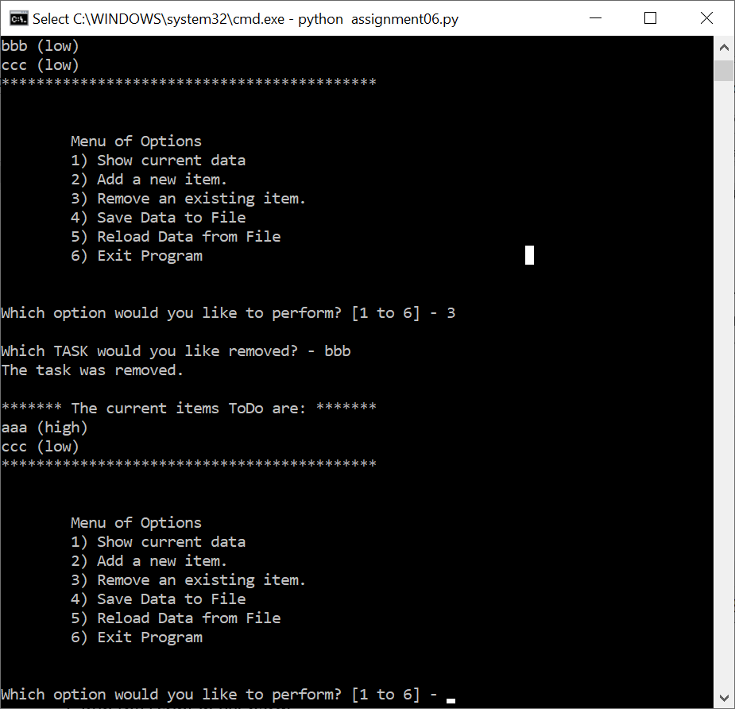

Tao Ye

May 20, 2020

Foundations of Programming: Python

Assignment 06

<https://github.com/bubblecfd/IntroToProg-Python-Mod06>

Python Script Using Functions

Introduction

In this assignment, I will modify a Python script to add functions to
replace some operations it performs to manage a \"ToDo list.\" The
purpose is to use functions to better organize the Python code. Same in
previous assignment 5, the \"ToDo list\" file contains two columns of
data, \"Task\" and \"Priority" that are read into a Python Dictionary
object. Each dictionary object represents one row of data, and these
rows are added to a Python List object to create a table of data.
The script will be tested and run in both PyCharm and a Windows command
shell as a console application.

Editing and Debugging Code in PyCharm

For this assignment, I created a new folder **C:\\\_PythonClass
\\Assignment06.** Then in PyCharm, I created a new project that uses the
**C:\\\_PythonClass\\Assignment06** folder as its location, and added
the Python template file **Assigment06\_Starter.py** under this project
and renamed it to **Assigment06.py**. For this assignment, I added the
following class and functions. The functions are listed by classes.

-   ***Class FileProcessor***

> In the **FileProcessor** class, two functions are added.

1.  **WriteListDataToFile** saves the list table to a file given the
    > list table and the file name as the parameters.

> \@staticmethod\
> def WriteListDataToFile(file\_name, list\_of\_rows):
>
> file = open(file\_name, **\"w\"**)\
> for row in list\_of\_rows:\
> file.write(row\[**\"Task\"**\] + **\",\"** + row\[**\"Priority\"**\] +
> **\"**\\n**\"**)\
> file.close()

2.  **FindFile** finds the "ToDo list" file given a file name before it
    > can be read. I used the **try: except** structure to capture the
    > **FileNotFoundError** in case the file does not exist. If the file
    > exists, the function returns a **True** Boolean value; otherwise,
    > it returns a **False** value.

> \@staticmethod\
> def FindFile(file\_name):\
> try:\
> file = open(file\_name)\
> file.close()\
> return True\
> except FileNotFoundError:\
> return False

-   ***Class ListOperations** is added.*

> In this class, several functions are added as described in the
> following.

1.  **AddNewItemToList** function adds a task and its priority in the
    > list and takes list table, task and priority strings as its
    > parameters. And because the list table is passed by reference, the
    > updated list table is visible in the main body of the code without
    > the need to have a return parameter for it. In the function, it
    > adds the new task only if that task is not already in the list. A
    > flag is set to signal the duplicates of the task.

> \@staticmethod\
> def AddNewItemToList(list\_of\_rows, task, priority):\
> *\
> *taskExist = False\
> \
> for row in list\_of\_rows:\
> if (row\[**\"Task\"**\].lower() == task.lower()):\
> taskExist = True\
> break\
> \
> if (not taskExist):\
> row = {**\"Task\"**: task, **\"Priority\"**: priority}*\
> *list\_of\_rows.append(row)*\
> *else:\
> print(**\"I am sorry, duplicate task in the list\"**)

2.  **RemoveItemFromList** function removes a task from the list table
    > given the list table and the task name as the parameters. The list
    > table is passed by reference; therefore the updated list table is
    > seen by the main code without the "return" statement by the
    > function. In the function, the task is removed by value (.remove
    > method) instead of by indexing (del statement). And a flag is set
    > to tell the user whether the task asked to be removed is in the
    > list.

> \@staticmethod
>
> def RemoveItemFromList(list\_of\_rows, taskToRemove):\
> *\
> *taskExist = False\
> \
> for row in list\_of\_rows:\
> if (row\[**\"Task\"**\].lower() == taskToRemove.lower()):\
> list\_of\_rows.remove(row)\
> taskExist = True\
> \
> if (taskExist):\
> print(**\"The task was removed.\"**)\
> else:\
> print(**\"I\'m sorry, but I could not find that task.\"**)

-   **Class IO**

> In this class, **InputTaskAndPriority** function is added to ask the
> user to enter a task and its priority. The functions takes no
> parameter and returns task and priority strings.
>
> \@staticmethod\
> def InputTaskAndPriority():
>
> task = str(input(**\"What is the task? - \"**)).strip()\
> priority = str(input(**\"What is the priority? \[high\|low\] -
> \"**)).strip()\
> return task, priority

-   ***Main body of the script***

> In the main body, these are the modifications that use functions to
> replace the block of statements.

1.  At the onset, the code reads the "ToDo List" file. It checks if the
    > file exists in the current folder; if so, it reads the data into
    > the list table. Otherwise, it alerts the user the file does not
    > exist.

> if FileProcessor.FindFile(strFileName):\
> FileProcessor.ReadFileDataToList(strFileName, lstTable)*\
> *else:\
> print(**\"File\"**, strFileName, **\"does not exist yet.\"**)

2.  To add a new item to the list, first the code asks the use to enter
    > the new task and its priority by calling the function
    > **IO.InputTaskAndPriority().** It returns the task and priority
    > strings.

> strTask, strPriority = IO.InputTaskAndPriority()
>
> Then the function **ListOperations.AddNewItemToList** is called to add
> this new task and priority in the list. The list table, the task and
> priority strings are passed to the function for processing.
>
> ListOperations.AddNewItemToList(lstTable, strTask, strPriority)

3.  To remove an item from the list, the code asks the user for the task
    > to be removed and then calls the function
    > **ListOperations.RemoveItemFromList** and passes the list table
    > and the task entered by the user.

> ListOperations.RemoveItemFromList(lstTable, strKeyToRemove)

4.  To save the list to a file, the code calls the function
    > **FileProcessor.WriteListDataToFile** and passes the file name and
    > the list table to be saved to this function.

> FileProcessor.WriteListDataToFile(strFileName, lstTable)

The code is tested in the PyCharm. Because the code is not too complex,
it is effective to debug it just by reading the error messages without
running it in the debug mode. The error messages pointed to the specific
line of the code to help identify the where the bug is originated. This
way, a couple of bugs were corrected.

Run the Script

1\. Run the script in a Windows command shell.

In the Windows shell, first change the current folder to
**C:\\\_PythonClass\\Assignment06** so the data file "ToDoFile.txt" will
be created in the desired folder. Then type in the python command to run
the script. Since this is the very first time this script is run, the
file "ToDoFile.txt" doesn't exist yet. To add some rows in the table,
option "2" is selected several times to add the following tasks and
priorities:

aaa, high

bbb, low

ccc, low

{width="6.23in" height="6.01in"}

Figure 1. Script Run in Windows Shell and Option "2" Selection

At this point, the results are shown in Figure 1.

Then, option "3" is tested to remove task "bbb", and the operation is
shown in Figure 2.

{width="6.23in" height="6.01in"}

Figure 2. Option "3" Execution

Now, option "4" is selected to save the list to the file. The file
"ToDoFile.txt" is created in the current folder and the content of the
file is shown in Figure 3 that matched the screen list in Figure 2.

{width="5.17in" height="1.9in"}

Figure 3. Content of the File "ToDoFile.txt"

These options tested the modifications I made to the code with
functions.

2\. Run the script in PyCharm

Same operations are observed in running the code in PyCharm, and the
details are not repeated here.

Conclusion

The assignment is to modify a Python script to use function calls to
replace block of statement for better organization of the code into
data, processing, and presentation parts. The class and functions are
added and called where appropriate. The modified script is tested in
both Windows shell and PyCharm and operates the same as the original
code. Therefore, the function implementation is successful.

